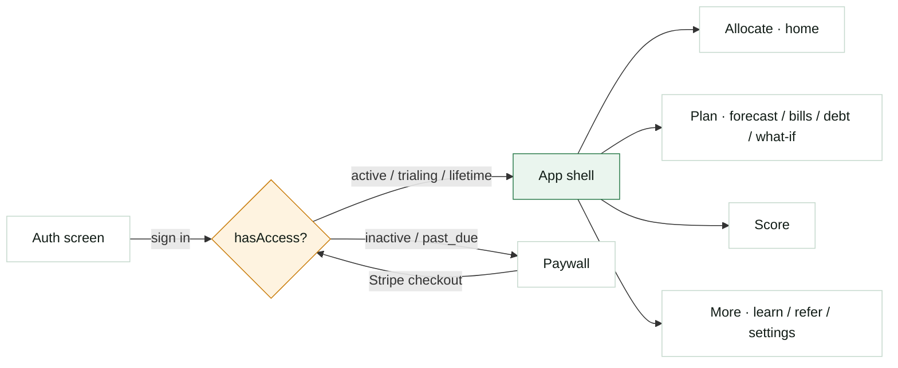
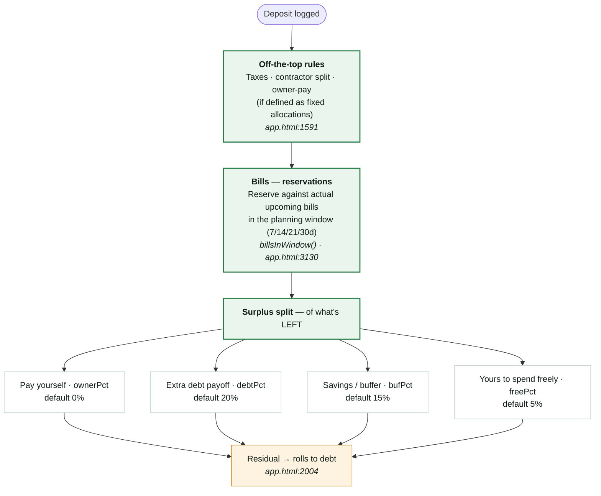
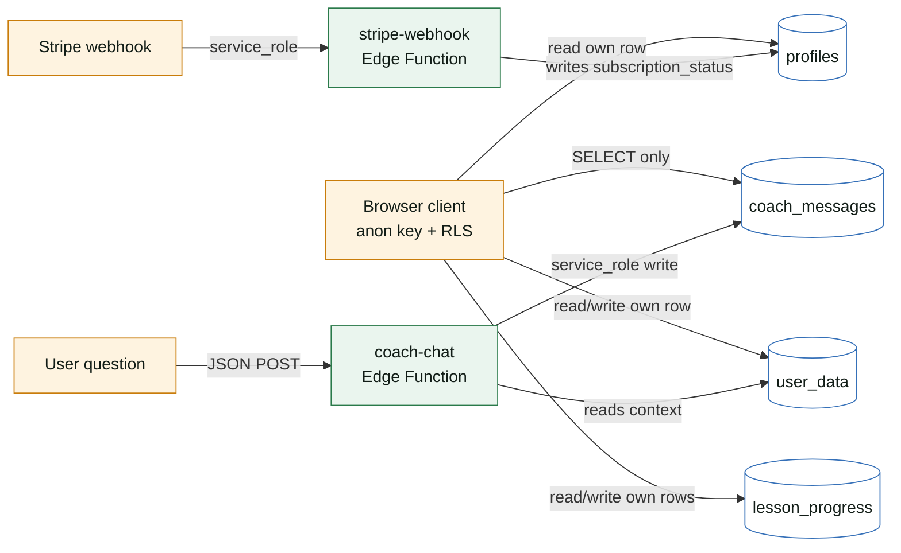

# Able — Design Document

**Last updated:** 2026-04-26
**Audience:** an engineer or designer joining (or evaluating) the codebase.
**Source of truth:** `app.html`, `index.html`, `supabase/`. When this doc and the code disagree, the code wins — please update this doc.

---

## 1. What Able is

Able is a budgeting app for people with **inconsistent income** — freelancers, creators, solo business owners, contractors. It is built around one promise: *From Unable → Able*.

The product is a **per-deposit allocation engine with manual income/bill entry and an AI advisor (the Coach)**. Every time the user logs a deposit, the app splits it across buckets in a fixed order. The user enters bills, debts, income sources, and balance manually. There is no Plaid auto-sync, no spending tracking, no auto-mark-paid. The Coach is a chat that has full read access to the user's allocation state.

That's the entire product. Everything else is in service of those two loops: **log deposit → see allocation** and **ask Coach → get specific advice**.

### Why it exists

The audience this app serves doesn't have a "spending problem" — they have a *timing* problem. Money lands on Day 1, leaks out by Day 14, and Day 30 is the panic. Generic budgeting tools (Mint, YNAB, spreadsheets) assume regular income and ask the user to track every transaction. Able inverts that: the user does almost nothing day-to-day, but every deposit is processed through a rule engine that sets aside money for taxes, bills, owner pay, debt, and a buffer *before* it can be spent.

### Who it is for

Three working personas (from `able-customer-research`):

- **The Freezer** — avoids opening the banking app. Wants permission and clarity.
- **The Leaker** — knows roughly where money goes but can't stop it draining. Wants structure.
- **The Shame-Cycle** — has tried YNAB / spreadsheets / envelopes, fell off, blames self. Wants something that survives a missed week.

---

## 2. Tech stack at a glance

| Layer | Choice | Notes |
|---|---|---|
| Frontend | **Single static HTML file** (`app.html`, ~9.5k LOC) | Inline CSS + vanilla JS, no build step. Loaded via `<script src="https://cdn.jsdelivr.net/npm/@supabase/supabase-js">`. |
| Marketing site | `index.html` (~2.9k LOC) + `/learn`, `/budgeting`, `/business`, `/taxes`, `/compare`, `/calculators`, `/resources`, `/legal` | Each is a static HTML page. No SSR. |
| Hosting | **Netlify** (auto-deploy from `main`) | Edge Functions are *not* on Netlify; see below. |
| Auth + DB | **Supabase** (PKCE flow, `localStorage`) | Tables: `user_data`, `profiles`, `coach_messages`, `lesson_progress`. RLS on all four. |
| Server logic | **Supabase Edge Functions** (Deno) | One function per concern (see §9). Pasted into the dashboard, not built locally — see `supabase/functions/README.md`. |
| Payments | **Stripe Checkout** + Customer Portal + webhook | Subscription lifecycle managed via `stripe-webhook` Edge Function with service role. |
| Email | **Resend** | Triggered by `email-cron-daily` Edge Function (16:00 UTC, once daily). |
| AI | **Anthropic Claude** | Called from `coach-chat` Edge Function. |

Why a single HTML file: shipping speed for a one-person team. The price is that `app.html` is large; the upside is zero build chain and trivial debugging in any browser. Treat it as a budget — when a section gets large enough, it gets extracted (the brand stylesheet at `/brand/_brand.css` is one such extraction).

---

## 3. Information architecture

The app has **two top-level surfaces** that live before the bottom-nav appears:

1. `#auth-screen` (`app.html:80`) — sign in / sign up.
2. `#paywall-screen` (`app.html:99`) — shown if `subscription_status` is not in `['active', 'trialing', 'lifetime']`.

Once authenticated *and* with access, the user sees the **bottom navigation** (`app.html:1245`) with four groups:



The 4 tabs are **groups**, not pages. Each group can route to one or more pages:

| Group | Default page | Other pages reachable |
|---|---|---|
| **Allocate** | `page-home` (`:1291`) — dashboard, deposit input, allocation preview | — |
| **Plan** | `page-bills` (`:1490`) | `page-forecast` (`:1411`), `page-debt` (`:1456`), `page-whatif` (`:1549`) |
| **Score** | `page-score` (`:1522`) — financial-health number + breakdown | — |
| **More** | menu | `page-settings` (`:1588`), `page-refer` (`:1713`), `page-learn` (`:1770`) |

Routing is handled by `goTo(group)` (`app.html:1246`). There is no URL fragment routing today — every page is `display:none` until activated.

### Page inventory (in order they appear in the source)

| Page ID | Line | Purpose |
|---|---|---|
| `page-home` | 1291 | The dashboard. Deposit input, headline numbers (balance, reserved, available), upcoming bills, recent allocations. |
| `page-forecast` | 1411 | Expected income with dates. Lets the user pre-allocate a known future deposit. |
| `page-debt` | 1456 | Debts table + extra-payoff plan. |
| `page-bills` | 1490 | Bills table (name, amount, frequency, due date), per-bill reservations. |
| `page-score` | 1522 | Financial health score + reasons. |
| `page-whatif` | 1549 | Scenario modeling — "what if I lost a client?" |
| `page-settings` | 1588 | All knobs (see §6). |
| `page-refer` | 1713 | Referral invites + earned-month tracking. |
| `page-learn` | 1770 | In-app lessons (`lesson_progress` table). |

---

## 4. Money-math model — the engine

This is the heart of Able. **Read this section twice.**

### 4.1 The fixed allocation order

Every deposit flows through the pipeline in this exact order:



**Critical vocabulary** (use verbatim in any user-facing copy — see `able-app-capabilities` skill):

- "Pay yourself" — not "owner pay" in UI. (Owner pay is acceptable in long-form articles.)
- "Extra debt payoff" — not just "debt".
- "Savings / buffer" — **never** "smoothing reserve". The word "smoothing" does not appear in the app.
- "Yours to spend freely" or "Spend freely".

**Common mistakes** in marketing/content that this doc exists to prevent:

- ❌ "Taxes / bills / smoothing / debt / free" — wrong order, wrong vocab. Taxes are off-the-top, not in the surplus split. Buffer is not called smoothing.
- ❌ "The buffer auto-releases when bills come due." False. The buffer is **one-way accumulation** — the user manually transfers from buffer to operating in slow months. The Coach can advise it; the app does not do it.
- ❌ "Plaid syncs your accounts." Not shipped. A single comment at `app.html:5622` references "Phase B" as the future Plaid integration.

### 4.2 Per-bill reservations (the post-2026-04-25 model)

Money set aside for bills is tracked **per-bill**, not as a scalar pool.

- **State:** `S.settings.reservations: { [billId]: amount }` — the single source of truth.
- **Computed:**
  - `_billReserved(billId)` — clamped to `bill.amount`.
  - `_totalReservedNow()` (`:5626`) — sum across unpaid bills, only when current month matches `allocResetMonth`.
  - `_availableToSpend()` (`:5636`) — `_getBalance() - _totalReservedNow()`.
- **Bill IDs** — every bill has a stable `id` assigned on load if missing. Reservations key off this; renaming a bill does not break its reservation.

The legacy scalar `S.allocated_to_bills` is **read-only** and frozen. New code must not write to it.

### 4.3 The smart bill window

`billsInWindow(days)` (`app.html:3130`) is the engine's view of "what's coming up":

- **Unpaid bill:** include if next occurrence is within the window.
- **Paid monthly bill:** include the *fresh* next occurrence (next month's due day) if it falls in the window. Override `paid: false` on the virtual entry so renderers don't strike it through.
- **Paid weekly/biweekly/custom:** skip. `applyOccurrenceReleases()` (`:3399`) handles cleanup.

Effect: marking April's truck loan paid on April 25 still surfaces May 5 in the window. The next deposit reserves fresh for it. This is what makes "set it and forget it" actually work for monthly bills.

### 4.4 Auto month rollover

`autoRolloverIfNewMonth()` (`app.html:3442`) runs on every load path.

- Detects month change via `allocResetMonth !== _currentMonthKey()`.
- Clears `paid` flags so this month's bills aren't permanently marked.
- **Preserves reservations** — set-aside money rolls forward with the bills.
- Updates `allocResetMonth`.
- Resets the legacy scalar to 0.

It does NOT auto-archive into `month_history` — that's a manual `resetMonth()` for users who want a clean record.

---

## 5. Data model

### 5.1 Client-side state (`S`)

Stored as a single JSON blob in `user_data.data` (JSONB column). The shape is the JSON the client serializes; there is no normalized schema.

```js
S = {
  bills:    [ { id, name, amount, dueDay, frequency, paid, ... } ],
  debts:    [ { name, balance, minPayment, ratePct, dueDay } ],
  income:   [ /* historical deposits with allocation breakdowns */ ],
  forecast: [ /* expected income */ ],
  sources:  [ /* user-defined income source labels */ ],
  obligations: [ /* off-the-top fixed allocation rules */ ],
  settings: {
    debtPct, bufPct, freePct, ownerPct,         // surplus split
    window,                                     // 7|14|21|30
    reservations: { [billId]: amount },         // per-bill earmarks
    balance,                                    // user-entered total
    allocResetMonth,                            // 'YYYY-MM' anchor
    lastOccurrenceCheck,                        // ISO date
    emailReminders: { ... },                    // 5 toggles
  },
  profile: { skipped, name, business, ... },
  // legacy / frozen:
  allocated_to_bills: 0,
}
```

### 5.2 Supabase tables

| Table | PK | Purpose | Client write? |
|---|---|---|---|
| `user_data` | `id` (= `auth.uid()`) | One row per user. `data` JSONB holds the entire `S` object. | Yes (RLS-gated to own row). |
| `profiles` | `id` | One row per user. `subscription_status`, Stripe customer/subscription IDs. | **No** — service role only via webhook. Read-only from client. |
| `coach_messages` | `(user_id, ts)` | Coach chat history. | **No** — service role writes via `coach-chat` Edge Function. Client SELECTs only. |
| `lesson_progress` | `(user_id, lesson_id)` | Per-lesson completion state. | Yes (RLS-gated). |

RLS policies live in `supabase/rls_policies.sql`. The `profiles` row is auto-created on signup by the trigger in `supabase/profile_trigger.sql`.

### 5.3 Why `profiles` is server-write-only

A signed-in user must not be able to flip their own `subscription_status` to `'lifetime'`. The client has SELECT only. All writes flow through Stripe → `stripe-webhook` Edge Function → service role insert/update.



---

## 6. Settings — what the user can actually tune

Settings page is grouped into 7 categories (`app.html:1588`):

1. **Fixed allocations** — off-the-top rules (taxes, contractor split, owner pay if defined here). Fire BEFORE the surplus split.
2. **Planning window** — 7 / 14 / 21 / 30 days. Determines how far out `billsInWindow` looks.
3. **Surplus split** — sliders for pay yourself / debt / buffer / free spending. Sum must be ≤ 100.
4. **Income sources** — user-defined dropdown labels (e.g. "Acme Corp", "Patreon").
5. **Email reminders** — 5 toggles: `bill_reminder`, `low_buffer`, `monthly_wrap`, `dormancy`, `weekly`. Honored by `email-cron-daily`.
6. **Subscription** — opens Stripe customer portal.
7. **Account** — email, replay tour, contact support, close month, clear data, sign out.

No A/B toggles or feature flags are user-visible.

---

## 7. Onboarding

Triggers if the user has no bills AND has not skipped (`profile.skipped !== true`).

**9 questions** (`OB_QUESTIONS`, `app.html:2398–2471`):

1. Welcome
2. Name + business
3. Income payment structure
4. Income sources list
5. Contractor / commission splits
6. Monthly bills (table)
7. Debts (table — name, min payment, rate %, due, balance)
8. Goals / priorities
9. Pay yourself percentage (default 10%)

Answers are sent to the `ai-onboard` Edge Function which parses bills, debts, sources, obligations from free-text. Skip is allowed (`skipOnboarding()` at `app.html:2486`).

---

## 8. AI Coach

The Coach is a real chat with full state context. It is **advisory only** — it does not move money.

### 8.1 What the Coach can see

`buildCoachState()` (`app.html:9117`) ships these fields to the model:

- All bills, debts, settings, sources, obligations, profile
- Headline numbers: `balance`, `reserved_total`, `available_to_spend`
- `reservations_by_bill` — per-bill `{bill, amount, reserved, days_until}` for unpaid bills with reservations > 0
- `past_due_bills` — monthly bills past due day, not paid
- `latest_deposit` — most recent income with full per-bill funding breakdown (`funded_prior` / `funded_now` / `partial` / `uncovered`)
- `balance_neutral` flag on deposits = "Tell me where it goes" reallocation, not new income
- Last 3 months of history
- Forecast data

The system prompt in `coach-chat/index.ts` teaches the model these field names. Updates to `buildCoachState` MUST be mirrored in the system prompt — it's the only way the model knows to reference them.

### 8.2 Proactive nudges

Three triggers:

1. Owner pay percentage = 0 but income has been logged.
2. Buffer low + bills due soon.
3. No income logged in 14+ days.

Dismissed nudges are suppressed for 12 hours (anti-nag).

### 8.3 Backend

`coach-chat` Edge Function. Rate-limited (returns 429/503). Daily message cap enforced server-side. Max 2000 chars per message client-side.

---

## 9. Edge Functions

All deployed on Supabase. **Verify JWT must be OFF** on every public-facing function (gateway-level auth would block our PKCE flow).

| Function | Purpose | Source |
|---|---|---|
| `coach-chat` | Claude API for the Coach | `supabase/functions/coach-chat/index.ts` |
| `email-cron-daily` | Daily transactional + behavioral emails (16:00 UTC) | `supabase/functions/email-cron-daily/index.ts` |
| `unsubscribe` | Email unsub link handler | deployed-only (source missing locally) |
| `create-checkout` | Stripe Checkout session | `supabase/functions/create-checkout/index.ts` |
| `create-portal-session` | Stripe Customer Portal | `supabase/functions/create-portal-session/index.ts` |
| `stripe-webhook` | Subscription lifecycle (`active` / `past_due` / etc.) | `supabase/functions/stripe-webhook/index.ts` |
| `send-referral-invite` | Referral email send | `supabase/functions/send-referral-invite/index.ts` |
| `ai-onboard` | Onboarding free-text parser | deployed-only (source missing locally) |

Deployment: edit locally, deploy via CLI (`scripts/deploy-functions.sh <name>`). The script runs `deno check` first to avoid the "duplicate const" boot failures we hit in 2026-04. The dashboard editor is *read-only in your head* — never edit there directly.

---

## 10. Subscription & paywall flow

### 10.1 Pricing (canonical, do not paraphrase)

- **Monthly:** $14.99/mo (`PRICE_MONTHLY` at `app.html:1962`)
- **Annual:** $129/yr (`PRICE_ANNUAL` at `app.html:1963`)
- **Annual savings framing:** "Save $50" or "Two months free" (14.99 × 12 − 129 = $50.88)
- **Lifetime:** dropped for new sign-ups; existing `lifetime` users grandfathered.

### 10.2 Trial

- **7 days.**
- **Card required.** Verbatim app text (`app.html:1192`): *"Card required. You won't be charged until day 8. Cancel anytime in Settings."*
- Any content claiming "no card required" is wrong.

### 10.3 Access gate

```js
// app.html:2131
const hasAccess = ['active', 'trialing', 'lifetime'].includes(status);
```

`subscription_status` enum: `trialing` · `active` · `past_due` · `inactive` · `lifetime`.

`startCheckout()` (`app.html:2752`) creates a session via `create-checkout`, redirects to Stripe, then polls `profiles.subscription_status` on return until it flips to `active` or `trialing`. Polling window was extended in commit `4e1b126` to handle webhook delay.

---

## 11. Visual design system

Verbatim tokens from `app.html` (`:36–71`) and `index.html`. The brand skill (`~/.claude/skills/able-brand/SKILL.md`) is the canonical reference for voice and visual rules.

### 11.1 Color tokens

| Token | Hex | Usage |
|---|---|---|
| `--ds-page` | `#f0f7f2` | Page background — pale sage, never pure white. |
| `--ds-card` | `#ffffff` | Card surface. |
| `--ds-card2` | `#f7fbf8` | Card surface, subtle tint. |
| `--ds-t1` | `#111c16` | Body text. |
| `--ds-t2` | `#4a5c52` | Secondary text. |
| `--ds-t3` | `#8ca898` | Muted text, labels. |
| `--ds-t4` | `#c4d8cc` | Borders, dividers. |
| `--ds-green` | `#2a7a4a` | Brand primary. |
| `--ds-green2` | `#1f6038` | Brand primary, darker. |
| `--ds-green-l` | `#eaf5ee` | Brand surface (positive backgrounds). |
| `--ds-green-m` | `#b8e0c8` | Brand mid (subtle accents). |
| `--ds-c1` | `#2a7a4a` | Category green (success / good). |
| `--ds-c2` | `#3d9e78` | Category teal-green. |
| `--ds-c3` | `#c97c0a` | Category amber (warn / highlight). |
| `--ds-c4` | `#c04060` | Category red (debt / danger). |
| `--ds-c5` | `#3570b8` | Category blue (info / links). |

### 11.2 Type

- **One face only:** Bricolage Grotesque, weights 400–900. System sans fallback. Do not introduce a second display face.
- Responsive type scale via `clamp()` — e.g. h1 `2.25rem–3.75rem`, h2 `2rem–3rem`.

### 11.3 Radius scale

- `--ds-r1: 12px` — inputs, small chips
- `--ds-r2: 18px` — cards
- `--ds-r3: 26px` — hero blocks, phone mockups, modal sheets

### 11.4 Shadows

- `--ds-sh1` — light, ambient
- `--ds-sh2` — mid, hover-lift
- `--ds-sh3` — strongest, modal/sheet depth

Green-tinted shadow (`rgba(42,122,74,.3)`) is reserved for hover-lift on primary CTAs only.

### 11.5 The wordmark

Single-source `.brand-wordmark` class (`app.html:86–91` and `_brand.css`) — Bricolage Grotesque 900, custom SVG underline that only underlines the word "Able" via an `::after` pseudo with `right:-4%`. This is canonical; never reimplement the swoosh.

Modifiers: `--lg`, `--xl`, `--green`. Wrapper: `.brand-wordmark-wrap` for centered alignment.

### 11.6 Motion rules

- **Scroll reveal:** `.reveal` fade-up, `0.6s ease`, threshold `0.12`.
- **Problem-beat stagger:** `180ms` between items. Do not loop.
- **Phone float:** `6s ease-in-out`, gentle. No bounce, no parallax.
- **Hover:** subtle shadow + 1px transform lift. No color flips, no rotations.
- **Allowed celebration:** the checkmark pop on completion. Use sparingly.

The brand pattern is **calm**. Faster motion breaks it.

### 11.7 Anti-patterns (do not ship)

- Em dashes anywhere in copy. (Use periods or line breaks.)
- "We" / "our team" voice. (Founder POV is Paul; use "you".)
- Tool-as-hero phrasing ("Able tells you what to do"). The user is the hero; Able is the guide.
- Stock-photo people. Use phone mockups + abstract green gradients only.
- Multiple display faces.
- Bouncy motion, parallax, autoplaying carousels.
- Pricing without the "7-day free trial" line. It is load-bearing.
- Pain framing that blames the user. Always pair pain with permission.

---

## 12. Layout — screen-by-screen

Live captures from the demo seed (`?demo=1`) at iPhone 14 Pro vertical (390×844 @2×). Captured by `scripts/capture-design-screens.py`. Re-run that script after any UI change to refresh.

### 12.1 Auth screen

The single canonical entry. Wordmark uses `.brand-wordmark--xl`. Pill-toggle between Sign in / Create account; Google OAuth above email/password.


### 12.2 Paywall screen

Shown when `subscription_status` is not in `['active', 'trialing', 'lifetime']`. Annual is the selected default with a **Save $41** badge; monthly is the ghost option. Fine print verbatim: *"Card required. You won't be charged until day 8. Cancel anytime in Settings."*


### 12.3 Onboarding (step 1 of 9)

Progress bar at the top, "STEP 1 OF 9" eyebrow, AI-style intro message, primary CTA, and a quiet "Skip for now and explore" escape.


### 12.4 Allocate / Home (`page-home`)

The dashboard. Past-due bills card at top (amber, with Review CTA), the green hero with **Add balance** + **Log income**, the monthly score band, and the bottom nav. The Coach FAB sits bottom-right.


The allocation preview sheet renders above the bottom nav (`z-index` fixed in commit `0708654`).

### 12.5 Plan / Bills (`page-bills`)

Sub-tab selector at the top (Forecast · **Bills** · Debt · What-if), monthly total, and a per-bill row with funded badge + due date + amount + Edit/×.


### 12.6 Score (`page-score`)

Big green number in a sage card, "S, elite budgeter" tier label, and the five contributing bands (bills covered, paid yourself, extra debt payments, buffer fund added, living in budget). "How you earn points" panel makes the rubric explicit.


### 12.7 Settings (`page-settings`)

Planning-window pill selector, recommendation copy, then the surplus-split sliders: Pay yourself · Extra debt payoff · Savings/buffer · Free to spend. Friendly preset CTA ("Use this") on the recommendation card.


### 12.8 Coach panel

Floating sheet from the FAB. Header: "Coach · Ask anything about your money. I see your bills, debts, buffer, and income." Conversation history is the seeded thread; the input bar pins to the bottom.


### 12.9 More group (default = Learn)

The More tab opens to Learn by default (sub-tabs: **Learn** · Refer · Settings). Money Literacy Score, badges, course progress, and the streak counter live here.


---

## 13. Voice + microcopy

The non-negotiables (mirrored from `able-brand`):

- **Short sentences. Plain language. No em dashes.**
- **Warm, calm, specific.** Not hype. Not corporate.
- **Customer is the hero. Able is the guide.** Tool-as-hero is wrong.
- **Permission, not blame.** *"The problem was never you. It was the advice you were handed."*
- **Identity language.** "You are able to..." not "Able does X for you."
- **Real specifics over claims.** "$500–$1,000 leaks every month" beats "save more money."
- Second person ("you"). Founder POV is Paul.

The signature **page-level bookend pattern**: every long-form page opens and closes on the same emotional axis — *paralysis → permission → system → outcome → identity shift*. Hero opens with the breath metaphor ("From holding your breath with bills → To finally able to breathe"); final CTA closes with "From Unable → Able."

The signature **Day 1–31 narrative anchor** is verbatim and load-bearing — never paraphrase loosely:

- Day 1: Money comes in. Just in time. Breathe a little.
- Day 7: A snack here, a subscription there.
- Day 14: The leak begins.
- Day 30: "Where did that $1,000 go?"
- Day 31: Shame. Guilt. Avoidance.

---

## 14. What is NOT shipped

This is the most-asked-about part of the doc. If a piece of content claims any of these, it is wrong.

| Feature | Status |
|---|---|
| Plaid auto-import deposits | NOT shipped (Phase B comment only at `app.html:5622`) |
| Auto-mark-paid bills | NOT shipped (manual checkbox only) |
| Buffer auto-release into bills | NOT shipped (one-way accumulation) |
| Spending tracking | NOT shipped (income-side only) |
| Bill auto-categorization | NOT shipped (no categories at all) |
| CSV import | NOT shipped |
| Bank connection of any kind | NOT shipped |
| The Coach moving money | NOT shipped (advisory only) |
| "Smoothing reserve" as a named feature | NOT a named feature (it's "buffer") |
| Taxes inside the surplus split | NOT — taxes are off-the-top fixed allocations |
| No-card trial | NOT — card is required |

When marketing wants something this list disallows, that's a product roadmap conversation — not a content edit. Ship the product change first, then update the `able-app-capabilities` skill, then write the marketing.

---

## 15. Deployment

- **Static HTML** (`index.html`, `app.html`, all `/learn`, `/budgeting`, `/business`, etc.) — auto-deploys from `main` to Netlify on every push.
- **Edge Functions** — deploy via `scripts/deploy-functions.sh <name>`. The CLI flow runs `deno check` locally, which catches the boot-time errors that bit us in 2026-04.
- **Database changes** — paste SQL into Supabase dashboard. Files in `supabase/*.sql` are the source of truth.
- **Environment variables** — Stripe keys, Anthropic key, Resend key, Supabase service role key — all set in Supabase Edge Function secrets.

Health checks:

- `.github/workflows/functions-check.yml` — runs `deno check` on every PR touching `supabase/functions/**`.
- `.github/workflows/functions-healthcheck.yml` — pings `create-checkout` every 5 minutes; opens a GitHub issue on 5xx/timeout.

---

## 16. Open questions / signals worth tracking

These are not decided. They are the live tensions a designer/engineer joining now should know about:

1. **`app.html` is approaching the limit of "single file is simpler".** At ~9.5k LOC, debugging is fine, but cognitive load grows fast. The brand stylesheet has been extracted; settings and onboarding are the next candidates if/when they grow further.
2. **Plaid (Phase B)** — the Coach state and reservations model are designed to absorb live-bank data without a rewrite. The shape of `S.settings.balance` was chosen specifically so it can become a Plaid-derived value with minimal churn.
3. **Buffer automation** — there is real product debate about whether the buffer should auto-release into bills in slow months. Today it does not (one-way). The honest answer in marketing is "you transfer manually." If we ship automation, that's a code change → skill update → content rewrite, in that order.
4. **Pricing** — currently $14.99/mo + $129/yr (reverted from $9.99/$79). The reversion was intentional; trial-with-card is converting better than trial-no-card was at the lower price.
5. **Coach trust** — the system prompt explicitly forbids the Coach from inventing actions it can't take. If the Coach starts hallucinating "I moved $200 to your buffer," that's a system prompt regression and needs immediate `coach-chat` redeploy.

---

## 17. Where to look for more

- `~/.claude/skills/able-app-capabilities/SKILL.md` — canonical "what Able does" reference. Updated on every product change.
- `~/.claude/skills/able-brand/SKILL.md` — voice, tokens, motion, anti-patterns.
- `~/.claude/skills/able-product-copy/` — in-app microcopy rules.
- `~/.claude/skills/able-customer-research/` — the three personas and their pain inventory.
- `supabase/functions/README.md` — Edge Function deploy + debug.
- `SETUP.md` — local dev + demo seed (`?demo=1`).

---

*This document is a living artifact. When you change the product, change this file in the same PR.*
